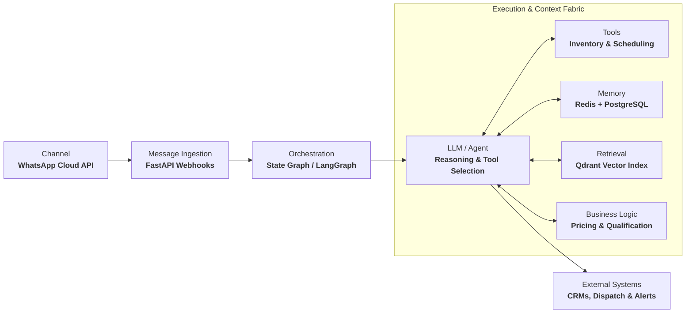

<div align="center">

<!-- Hero Banner -->


<!-- Dynamic Typing Subhead -->
<a href="https://github.com/kelly26ici">
  
</a>

<p align="center">
  
  
  
  <a href="https://wa.me/254794582488"></a>
  <a href="https://github.com/kelly26ici"></a>
</p>

</div>

---

### ⚡ Overview

I build production-grade AI systems that connect models to real-world data, tools, APIs, and autonomous workflows. My work sits at the intersection of LLMs, agentic architecture, RAG, machine learning, backend engineering, and AI integrations.

```text
┌──────────────────────────────────────────────────────────────┐
│                        AI ENGINEERING                        │
├──────────────────────────────────────────────────────────────┤
│  LLMs              Agents              RAG                   │
│  Tool Calling      Memory              Workflows             │
│  NLP               ML Systems          AI Integrations       │
│  FastAPI           PostgreSQL          Redis / Vector DBs    │
└──────────────────────────────────────────────────────────────┘
```

---

### 🧩 What I Build

* **Agentic AI Systems**: Autonomous architectures equipped with tools, memory, planning, and multi-step execution loops that solve end-to-end operational problems.
* **Grounded RAG Pipelines**: High-precision retrieval systems leveraging dense vector embeddings, hybrid search, and context re-ranking for knowledge-intensive applications.
* **AI Long-Term Memory Systems**: Multi-tier state persistence combining relational stores (PostgreSQL), high-throughput key-value caches (Redis), and vector indices (Qdrant) for persistent entity and conversation recall.
* **LLM Integrations Across Ecosystems**: Resilient provider integrations with structured JSON outputs, latency fallbacks, and streaming execution across frontier and open-weight models.
* **Production ML Pipelines**: Deterministic pipelines spanning data ingestion, feature preprocessing, model inference, and monitoring.
* **AI Automation & Backends**: Async microservices and webhook architectures that reliably connect models to enterprise databases, third-party APIs, and core business logic.

---

### 🏛️ Featured Engineering: Samantha

> **Production-Oriented AI Real-Estate Agent**  
> An autonomous agentic system engineered to converse with prospective clients, extract conversational intent, dynamically query real estate inventories, maintain longitudinal customer memory, execute business tools, and integrate with external communication channels.



#### System Architecture & Stack
* **Conversational Interface**: Integrated directly with **WhatsApp Cloud API** for multi-tenant, asynchronous client communication.
* **Longitudinal Memory Fabric**: Multi-tier persistence (**Redis** for real-time session scratchpads, **PostgreSQL** for durable historical context and CRM entity tracking).
* **Semantic Property Retrieval**: Sub-second property search powered by **Qdrant** vector database with hybrid metadata filtering (locality, budget, amenities).
* **Deterministic Tool Execution**: Hardened function calling with schema validation to ensure accurate inventory checks, tour bookings, and agent dispatching.
* **Core Stack**: `Python` · `FastAPI` · `PostgreSQL` · `Redis` · `Qdrant` · `LangGraph` · `LLM APIs` · `WhatsApp Cloud API` · `Docker`

---

### 🛠️ Core Stack

<table>
  <tr>
    <td width="26%"><strong>AI / ML</strong></td>
    <td>
      <code>Python</code> · <code>PyTorch</code> · <code>Transformers</code> · <code>LLMs</code> · <code>NLP</code> · <code>RAG</code> · <code>Embeddings</code>
    </td>
  </tr>
  <tr>
    <td><strong>Agent Engineering</strong></td>
    <td>
      <code>LangChain</code> · <code>LangGraph</code> · <code>Deep Agents</code> · <code>Tool Calling</code> · <code>MCP (Model Context Protocol)</code> · <code>Agent Memory</code>
    </td>
  </tr>
  <tr>
    <td><strong>Backend &amp; APIs</strong></td>
    <td>
      <code>FastAPI</code> · <code>PostgreSQL</code> · <code>Supabase</code> · <code>Redis</code> · <code>REST APIs</code> · <code>Asyncio</code>
    </td>
  </tr>
  <tr>
    <td><strong>Data / Infrastructure</strong></td>
    <td>
      <code>Qdrant</code> · <code>Docker</code> · <code>Linux</code> · <code>Git</code> · <code>GitHub Actions</code>
    </td>
  </tr>
  <tr>
    <td><strong>Environment</strong></td>
    <td>
      <code>Arch Linux</code> · <code>Neovim</code> · <code>Fish Shell</code> · <code>Hyprland</code>
    </td>
  </tr>
</table>

---

### 📐 Engineering Philosophy

> **« Models are components. Systems are the product. »**

I focus on the rigorous engineering surrounding AI models:  
$$\text{reliability} \longrightarrow \text{architecture} \longrightarrow \text{observability} \longrightarrow \text{memory} \longrightarrow \text{tools} \longrightarrow \text{retrieval} \longrightarrow \text{deployment}$$

* **The goal is not simply to make an LLM generate an impressive response.**  
  The goal is to build systems that can reason, retrieve, act, recover from failure, and operate against real-world constraints.
* **Deterministic Guardrails over Probabilistic Cores**: State machines and validation schemas must govern freeform token generation to guarantee operational correctness.
* **Design for Degradation**: Every upstream API throttles or produces unexpected tokens eventually. Resilient architectures incorporate circuit breakers, fallback trees, and self-healing execution loops.

---

### 🎯 Current Focus

```python
focus = {
    "systems": [
        "Agentic AI",
        "LLM infrastructure",
        "RAG systems",
        "AI integrations",
        "Production ML",
    ],
    "principles": [
        "Build real systems",
        "Design for failure",
        "Keep architectures composable",
        "Ship useful software",
    ],
}
```

*Building systems where AI can actually do things.*

---

### 📊 Telemetry & Activity

<div align="center">

<!-- Generated via lowlighter/metrics automated workflow -->


<br/>

<!-- Real-time Streak Telemetry -->


</div>

---

<div align="center">
  <sub>Rexkelly Muhoro Njoroge · AI &amp; ML Engineer · <a href="https://github.com/kelly26ici">github.com/kelly26ici</a></sub>
</div>
